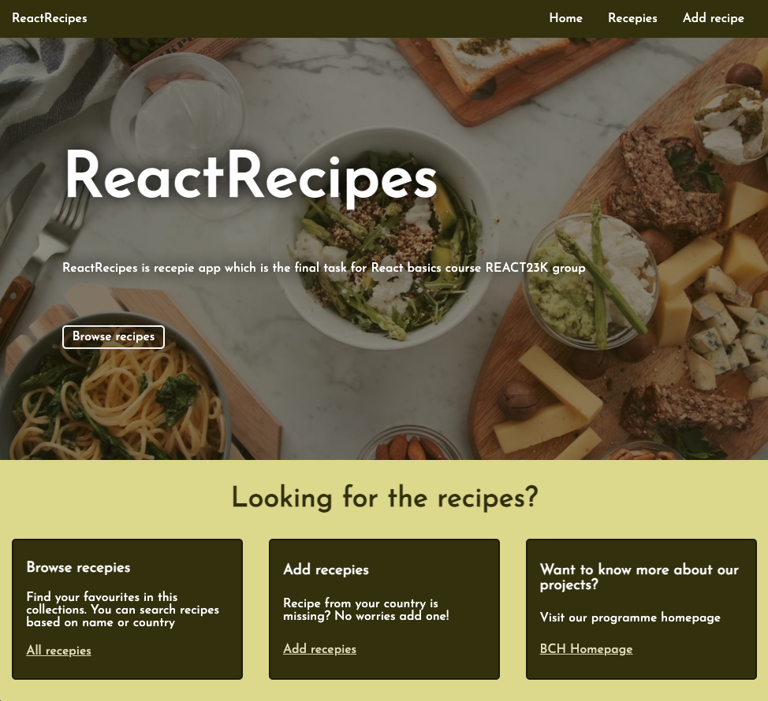
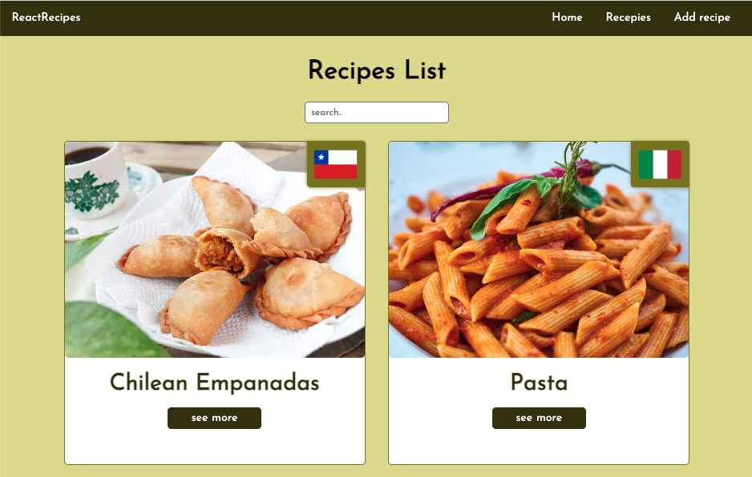
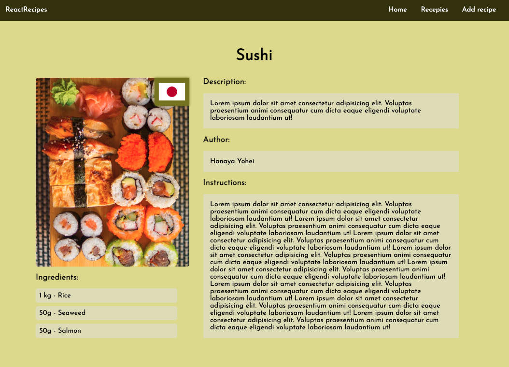

# Recipes App made with React

## Description
This is a React Application which allows users to browse a list of recepies, inluding number decription, instructions, list of ingredients and an image of the dish.

This project was made in the scope of a school assigment @Helsinki Business College under the tutoring of Ms. [Margit Tennosaar](https://github.com/margittennosaar).

## Technologies
- React
- JSON server
- JavaScript
- HTML
- CSS

## Directions

1. To browse already posted recepies click on the top navigation menu "Recepies" or the "All recepies" link at the first information card from left to right, at the landing page(home).
2. To know more details of a recipe listed in the page, click the "See more" button at button of the recipe card.
3. After that, you'll see a recepie profile with more details of the recepie and how to go about its preparation.
4. To create a recipe yourself, click the "Add recipe" link at the top menu, or the "Add recipes" link at the middle information card at the home page.
5. Add the necessary deatils in the form and click the "post recipe" button.
6. See your recipe posted in the list of receipies at the Recipes page.

## Screenshot

### Homepage

### Recipe list page

### Recipe Profile Page

## Live Page

See it [here](https://clever-licorice-ef4ec5.netlify.app/)

## Credits

The assignment and guidance were provided by [Margit Tennosaar](https://github.com/margittennosaar) during May 2023 [@Helsinki Business College](https://www.bc.fi/).

Country flags provided through API by [CountryFlags](https://flagsapi.com/).

Images and video provided by [pexels.com](https://www.pexels.com/).

Favicon is from [unicode.org](https://unicode.org/emoji/charts/emoji-list.html#1f957)
